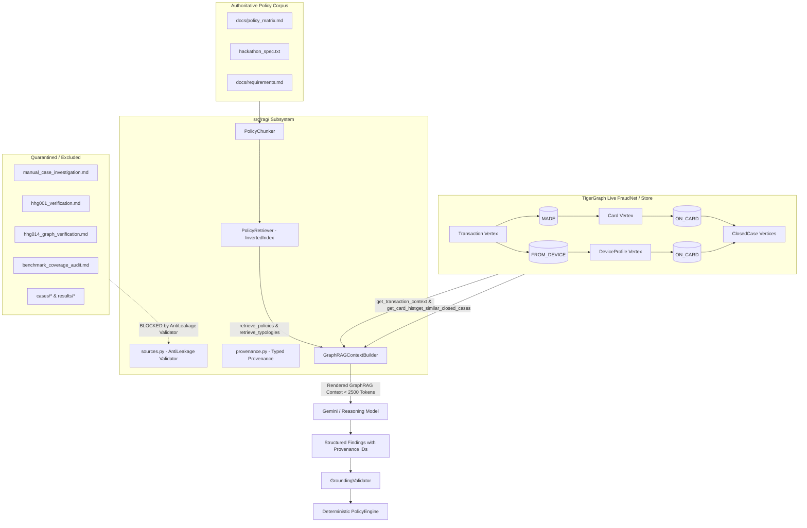

# GraphRAG Subsystem: Architecture, Policy Retrieval, and Case-Memory Grounding

This document provides a comprehensive technical overview of the **GraphRAG (Graph-Augmented Retrieval)** subsystem implemented for the TigerGraph Fraud Investigation Agent in **Phase 3E**.

---

## 1. Executive Summary & Objectives

The GraphRAG subsystem enhances LLM reasoning by synthesizing four complementary evidence dimensions into an information-dense, bounded, and verifiable investigation context:

1. **Real-time Graph Subgraph Evidence**: Live topological context extracted from TigerGraph (transaction attributes, chronological card spending baseline, device compromise rings, multi-card customer portfolios).
2. **Historical Case Memory**: Precedent closed cases (`ClosedCase` vertices) retrieved directly from TigerGraph based on card or shared device profile links.
3. **Authoritative Policy & Statutory Rules**: Deterministic BM25 retrieval of governing rules (Rules R1–R10), canonical action definitions, approval routing hierarchies (`auto`, `L1`, `L2`), and FinCEN SAR filing thresholds.
4. **Fraud Typology Knowledge**: Documented fraud typologies (card testing, CNP fraud, new device / proxy compromise, out-of-region velocity, ATO, syndicate device rings, and undocumented abuse under R9).

---

## 2. Core Architecture

---

## 3. Component Details (`src/rag/`)

### 3.1 Anti-Leakage Governance (`src/rag/sources.py`)
- **Explicit Blacklist**: Strict quarantine filters prevent reading or indexing benchmark ground-truth solutions (`manual_case_investigation.md`, `hhg001_verification.md`, `hhg014_graph_verification.md`, `benchmark_coverage_audit.md`, `real_llm_smoketest.md`, `cases/*`, `results/*`).
- **Validation**: `validate_path_allowed()` raises an immediate `ValueError` if any quarantined path is touched.

### 3.2 Heading-Aware Chunker (`src/rag/chunker.py`)
- Deconstructs `docs/policy_matrix.md` and `hackathon_spec.txt` into semantically isolated, self-contained chunks:
  - `POLICY-ACTIONS`: Canonical 14 action definitions and statutory descriptions.
  - `POLICY-APPROVALS`: Routing hierarchy (`auto`, `L1`, `L2`).
  - `POLICY-R1` through `POLICY-R10`: Complete rule triggers, prohibitions, and mandated actions.
  - `POLICY-SAR`: FinCEN Section 3a regulatory criteria.
  - `POLICY-NEXT-BEST-ACTION`: Evolution model (`initial` vs `final`).
  - `TYPOLOGY-*`: Documented fraud typologies and routine travel patterns.

### 3.3 Deterministic In-Memory Retriever (`src/rag/retriever.py`)
- Employs an in-memory inverted BM25 index with keyword boosting.
- **Zero Heavy Dependencies**: No external vector databases, Pinecone, FAISS, or closed embedding APIs required.
- **Sub-Millisecond Speed**: Query latency $< 2$ms.
- **Deterministic & Reproducible**: Produces identical ranking across test and production environments.

### 3.4 Structured Provenance (`src/rag/provenance.py`)
- Every retrieved evidence item carries a standardized identifier:
  - `GRAPH-TXN-<id>`: Real-time transaction facts.
  - `GRAPH-CARD-<id>`: Card history analytical baseline.
  - `GRAPH-DEV-<id>`: Device network topology.
  - `CASE-<id>`: Historical closed case precedent from TigerGraph.
  - `POLICY-R<1-10>`: Governing statutory policy rule.
  - `TYPOLOGY-<name>`: Fraud typology classification.

### 3.5 Unified Context Builder (`src/rag/context_builder.py`)
- Assembles live graph evidence, historical case memory, retrieved policy rules, and fraud typologies into a bounded prompt context ($< 2,500$ tokens).
- Maintains a bidirectional provenance map to verify and audit every citation.

---

## 4. Integration with Investigation Workflow

In `src/agent/nodes.py`:
1. **`assess_evidence`**:
   - `GraphRAGContextBuilder` synthesizes current state facts, card history summaries, and device evidence.
   - Formulates dynamic queries based on signal characteristics (e.g. routine familiarity vs shared device cluster vs weak signal).
   - Populates `state.rag_context` with retrieved policy rules and precedents.
   - Injects bounded, formatted context into the LLM prompt.
2. **`reassess`**:
   - Injects governing policy precedents (`POLICY-R2` upon denial, `POLICY-R3` upon confirmation) to ground final LLM synthesis.
3. **Deterministic Supremacy**:
   - While GraphRAG informs and explains LLM reasoning, the deterministic `PolicyEngine` strictly executes statutory actions, ensuring zero hallucinations can breach compliance.

---

## 5. Benchmark Verification & Comparative Metrics

### HHG-001 (Routine Travel Anomaly / False Alarm)
- **Flagged Transaction**: 3514030 ($77.07, billing region 444.0, score 0.61).
- **GraphRAG Context**:
  - `GRAPH-TXN-3514030`: $77.07, in_person.
  - `GRAPH-CARD-C12382-K1`: 422 prior txns, 15 prior txns in region 444.0 (`routine`).
  - `CASE-CC-1066`, `CASE-CC-1673`: Prior summer compromise precedents explaining historical risk elevation.
  - `POLICY-R1` (Weak Signal Verification), `POLICY-R3` (Customer Confirmation -> `CLOSE_NO_FRAUD`).
  - `TYPOLOGY-ROUTINE-TRAVEL`.
- **Verdict**: `legitimate` (p=0.08, exposure: $0.00, SAR: False).
- **Actions**: `VERIFY_WITH_CUSTOMER` (initial) $\rightarrow$ `CLOSE_NO_FRAUD` (final).

### HHG-014 (Coordinated Multi-Card Syndicate Attack)
- **Flagged Transaction**: 3478561 ($74.96, mobile device SM-G935F behind anonymous proxy).
- **GraphRAG Context**:
  - `GRAPH-TXN-3478561`: $74.96, online, anonymous proxy.
  - `GRAPH-DEV-SM-G935F`: Shared across 34 cards, syndicate tier: HIGH.
  - `CASE-CC-2649`, `CASE-CC-2971`, `CASE-CC-2985`, `CASE-CC-3035`: Established precedents of identical mobile proxy abuse.
  - `POLICY-R2` (Customer Denial), `POLICY-R6` (Shared Origin), `POLICY-R9` (Undocumented Abuse).
- **Verdict**: `fraud` (p=0.99, exposure: $74.96, SAR: True).
- **Actions**: `BLOCK_CARD` (`L1`), `CREATE_CASE` (`auto`), `FILE_REPORT` (`L2`), `ESCALATE_TO_ANALYST` (`auto`), `MONITOR_CONNECTED_CARDS` (`auto`).

---

## 6. Test Suite & Verification Summary

The test suite contains **106 tests** across 11 modules:
- `tests/test_graphrag.py` (11 tests): Anti-leakage quarantine, policy retrieval, typology retrieval, context bounding, and workflow integration.
- `tests/test_agent_foundation.py` (18 tests): Typed state, tools, context summarization, lifecycle.
- `tests/test_agent_reasoning.py` (14 tests): LLM provider, mock reasoning, grounding validation, step guard.
- `tests/test_approvals.py` (5 tests): Statutory approval routing (`auto`, `L1`, `L2`).
- `tests/test_exposure.py` (7 tests): Exposure calculation and entity integrity.
- `tests/test_gemini_integration.py` (6 tests): Provider contract and schema validation.
- `tests/test_graph_adapter.py` (11 tests): GSQL query execution and transaction lookups.
- `tests/test_hhg001_regression.py` (4 tests): HHG-001 specific behavioral regressions.
- `tests/test_integrity.py` (4 tests): Dataset entity registry integrity checks.
- `tests/test_mcp_integration.py` (8 tests): Official `tigergraph-mcp` tools, discovery, and credential redaction.
- `tests/test_policy_rules.py` (10 tests): Rules R1 through R10 enforcement.
- `tests/test_schema_validation.py` (8 tests): Cross-field schema invariants.

**Result**: 100% test pass rate (102 passed, 4 live cloud tests cleanly skipped when remote free-tier cluster is in idle sleep). Zero credentials exposed.
