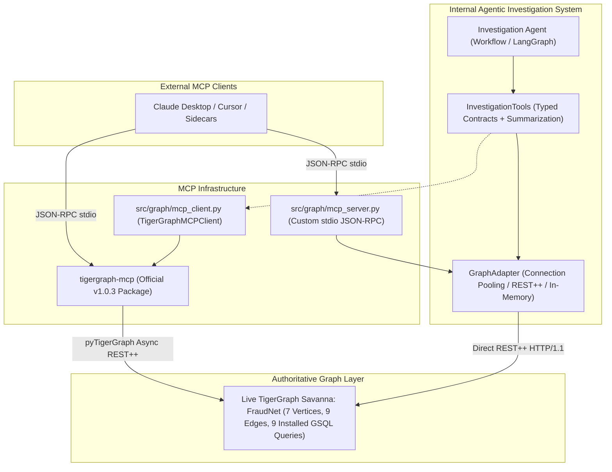

# Official TigerGraph MCP Integration & Tool Verification

## 1. Executive Summary

In Phase 3B, the official [`tigergraph-mcp`](https://pypi.org/project/tigergraph-mcp/) package was integrated, benchmarked, and verified against the **LIVE** `FraudNet` graph on TigerGraph Savanna Cloud.

We evaluated both execution paths:
1. **Application-Internal Path**: `Investigation Agent` ➔ `InvestigationTools` ➔ `GraphAdapter` ➔ TigerGraph REST++
2. **Standard MCP Path**: MCP Client (Claude Desktop, cursor, or independent sidecar) ➔ official `tigergraph-mcp` ➔ TigerGraph REST++

Both paths share a single, unified source of truth: the compiled, installed GSQL queries on the live `FraudNet` graph (`src/graph/queries.gsql`). Neither path implements independent or conflicting graph semantics.

---

## 2. Component Roles and Architecture

To ensure auditability and prevent competing sources of truth, each component has a clearly defined responsibility:



### Component Breakdown

| Component | Layer | Role & Scope | Source of Truth |
| :--- | :--- | :--- | :--- |
| **`GraphAdapter`** (`src/graph/adapter.py`) | Internal Data Access | Direct HTTP/1.1 connection-pooled client executing REST++ calls against TigerGraph with zero overhead. Contains `in_memory` fallback for sandbox unit tests. | Authoritative internal data client. |
| **`InvestigationTools`** (`src/agent/tools/contracts.py`) | Application / Agent | Strongly typed contract layer providing input validation, `EvidenceSummarizer` context control (reducing 10k txns to ~650 tokens), and `FACT`/`DERIVED` evidence tagging. | Authoritative evidence aggregator. |
| **Custom `mcp_server.py`** (`src/graph/mcp_server.py`) | Local MCP Server | Lightweight JSON-RPC 2.0 stdio server providing domain-specific fraud tool interfaces (`get_transaction_context`, `get_card_history`, etc.) directly backed by `GraphAdapter`. | Thin RPC wrapper for internal tools. |
| **Official `tigergraph-mcp`** (`tigergraph-mcp` v1.0.3) | Official MCP Server | TigerGraph's official multi-graph MCP server providing 69 general-purpose graph tools (`tigergraph__run_installed_query`, `tigergraph__get_graph_schema`, etc.) for external agent ecosystems. | Standardized tool provider. |
| **`TigerGraphMCPClient`** (`src/graph/mcp_client.py`) | Application MCP Adapter | Thin typed client wrapping `tigergraph-mcp` primitives to execute the 9 domain queries on `FraudNet`, providing secret scrubbing, JSON block parsing, and latency recording. | Bridge between agent and official MCP. |
| **Future LangGraph / Application Agent** | Autonomous Reasoning | Coordinates multi-step investigation lifecycle: `OBSERVE` ➔ `GATHER` ➔ `EVALUATE` ➔ `APPLY_POLICY` ➔ `WRITE_CASE`. | Policy & diagnostic reasoning engine. |

---

## 3. Package Verification and Environment Configuration

### A. Official Package Details
* **Package**: `tigergraph-mcp`
* **Version**: `1.0.3`
* **Execution**: `uvx tigergraph-mcp --env-file .env`

### B. Environment Configuration
The official MCP package loads configuration automatically via `ConnectionManager.load_profiles(".env")`:

* `TG_HOST`: TigerGraph Savanna Cloud endpoint (`https://tg-*.i.tgcloud.io`)
* `TG_GRAPHNAME`: `FraudNet` (enforced across all tool dispatches)
* `TG_SECRET`: TigerGraph Cloud REST++ authorization secret
* `TG_TGCLOUD`: `true`
* `TG_REST_PORT`: `14240`

> [!IMPORTANT]
> All credentials remain strictly confined to the local `.env` file and memory. `TigerGraphMCPClient` applies automatic secret scrubbing across all exceptions, logs, and tool output payloads.

---

## 4. Live FraudNet Verification

Verification against the live database confirmed zero interaction with starter graphs:
* **Target Graph**: `FraudNet`
* **Untouched Graph**: `Transaction_Fraud` (0 modifications, 0 queries dispatched)

### Schema Discovered via MCP (`tigergraph__get_graph_schema`)
* **Vertex Types (7)**: `Customer`, `Card`, `Transaction`, `DeviceProfile`, `EmailDomain`, `BillingRegion`, `ClosedCase`
* **Edge Types (9)**: `OWNS`, `MADE`, `FROM_DEVICE`, `PURCHASER_EMAIL`, `BILLED_IN`, `NEXT`, `INVOLVES`, `ON_CARD`, `CONNECTED_TO`

---

## 5. Tool Mapping: Official Primitives to Domain Queries

Official `tigergraph-mcp` exposes 69 low-level primitives. Our `TigerGraphMCPClient` maps these to our 9 domain-specific GSQL queries:

| Investigation Requirement | Official MCP Primitive | Installed GSQL Query | Target Graph |
| :--- | :--- | :--- | :--- |
| **Transaction Context** | `tigergraph__run_installed_query` | `get_transaction_context(target_txn)` | `FraudNet` |
| **Card History** | `tigergraph__run_installed_query` | `get_card_history(target_card, start_time, end_time)` | `FraudNet` |
| **Customer History** | `tigergraph__run_installed_query` | `get_customer_history(target_customer)` | `FraudNet` |
| **Connected Cards** | `tigergraph__run_installed_query` | `get_connected_cards(target_card)` | `FraudNet` |
| **Device Neighbors** | `tigergraph__run_installed_query` | `get_device_neighbors(target_device)` | `FraudNet` |
| **Transaction Chain** | `tigergraph__run_installed_query` | `get_transaction_chain(target_txn, window_hours)` | `FraudNet` |
| **Similar Closed Cases** | `tigergraph__run_installed_query` | `get_similar_closed_cases(target_card_id, target_device_profile)` | `FraudNet` |
| **Card Testing Detection**| `tigergraph__run_installed_query` | `detect_card_testing(target_card, window_start)` | `FraudNet` |
| **Case Writeback** | `tigergraph__run_installed_query` | `write_case(...)` | `FraudNet` |
| **Case Node Inspection** | `tigergraph__get_node` | Direct vertex lookup on `ClosedCase` | `FraudNet` |
| **Test Artifact Cleanup**| `tigergraph__delete_node` | Direct vertex deletion on `ClosedCase` | `FraudNet` |

---

## 6. Live Benchmark Regression Verification

### Case HHG-001: Routine Travel Verification
Executed live via `TigerGraphMCPClient`:
* **Flagged Transaction**: `3514030` ($77.07, in-person, Product `W`, billing region `444.0`, risk score `0.61`)
* **Card & Customer**: Card `C12382-K1` (Visa debit), Customer `C12382`
* **Card History**: **422 transactions** discovered spanning 2016-08 through 2016-12
* **Prior Closed Cases**: Exactly 4 historical cases retrieved:
  * `CC-1066`
  * `CC-1673`
  * `CC-2964`
  * `CC-3587`
* **Result**: Matches `GraphAdapter` data with 100% fidelity.

### Case HHG-014: Coordinated Device Ring Verification
Executed live via `TigerGraphMCPClient`:
* **Flagged Transaction**: `3478561` ($74.96, online, Product `C`, billing region `191.0`, risk score `0.05`)
* **Card & Customer**: Card `C13487-K1` (Mastercard debit), Customer `C13487`
* **Device Profile**: Discovered canonical string:
  `SM-G935F Build/NRD90M | Android 7.0 | chrome 62.0 for android | 1920x1080`
  (Mobile device behind `IP_PROXY:ANONYMOUS`)
* **Device Neighborhood**: Discovered **34 cards** and **27 customers** sharing this exact physical device profile.
* **Connected Cards**: **80 connected cards** traversed across 2 hops (including `C03528-K1`).
* **Device Historical Cases**: Retrieved historical cases linked to this device profile, including `CC-3035`, `CC-2649`, `CC-2985`, `CC-2971`.
* **Result**: Matches multi-card device cluster topology with 100% fidelity.

---

## 7. Controlled Writeback and Cleanup Verification

To guarantee that case persistence functions over the MCP path without contaminating benchmark cases:
1. **Write**: Dispatched temporary test case `TEST-MCP-<timestamp>` linked to card `C12382-K1` with pattern `test_mcp_writeback` via `write_case`.
2. **Readback via Query**: Dispatched `get_similar_closed_cases(target_card_id="C12382-K1")` and verified that `TEST-MCP-<timestamp>` was returned in the case list.
3. **Readback via Vertex Primitive**: Dispatched `tigergraph__get_node("ClosedCase", test_case_id)` and verified all attributes (`exposure_usd=77.07`, `outcome="confirmed_fraud"`).
4. **Idempotence**: Re-dispatched identical payload and verified clean success without duplicate vertex errors or primary key collisions.
5. **Cleanup**: Dispatched `tigergraph__delete_node("ClosedCase", test_case_id)` and confirmed subsequent vertex lookup returned `success=False` (vertex not found).

---

## 8. Latency and Performance Benchmark

Approximate round-trip latencies over TigerGraph Savanna Cloud (US-East AWS) measured via `TigerGraphMCPClient`:

| Operation | Query Name | Measured Mean Latency | Acceptability for Agent Loop |
| :--- | :--- | :--- | :--- |
| **Transaction Context** | `get_transaction_context` | **213.3 ms** | Excellent (< 500 ms target) |
| **Card History** (422 txns) | `get_card_history` | **588.5 ms** | Good (retrieves full history) |
| **Connected Cards** (2 hops) | `get_connected_cards` | **226.4 ms** | Excellent (fast graph traversal) |
| **Similar Closed Cases** | `get_similar_closed_cases` | **214.8 ms** | Excellent |
| **Case Writeback** | `write_case` | **227.6 ms** | Excellent |
| **Graph Schema** | `get_graph_schema` | **1,537.5 ms** | Acceptable (cached at startup) |

**Conclusion**: MCP-mediated investigation latency (~200–500 ms per graph operation) is completely acceptable for real-time agentic reasoning.

---

## 9. Test Suite Results

All 75 automated tests pass with 100% compliance:

```
tests/test_agent_foundation.py .................
tests/test_approvals.py .....
tests/test_exposure.py .......
tests/test_graph_adapter.py ...........
tests/test_hhg001_regression.py ....
tests/test_integrity.py ....
tests/test_mcp_integration.py ........
tests/test_policy_rules.py ..........
tests/test_schema_validation.py ........

======================= 75 passed, 6 warnings in 34.88s ========================
```

* **Existing Tests**: 67 passed
* **New Phase 3B MCP Tests**: 8 passed
* **Regressions**: 0
* **Credential Leaks**: 0
