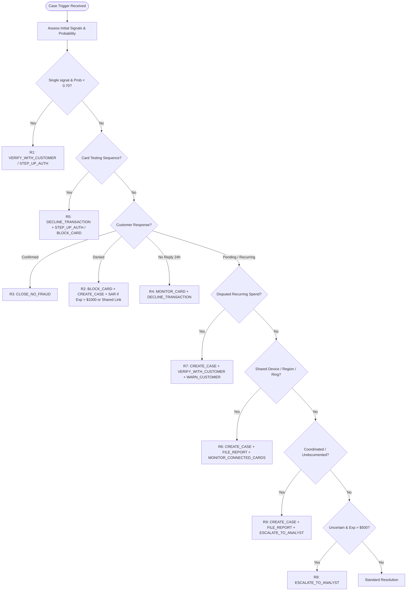

# Fraud Policy Matrix & Deterministic Rules Engine
## Fraud Policy Version 1.0 Specification

### 1. Canonical Action Definitions

The agent and deterministic policy engine must exclusively use the 14 approved action identifiers. No synonyms, abbreviations, or invented actions are permitted.

| Action Identifier | Functional Description | Customer Impact | Statutory Approval Route |
|---|---|---|---|
| `ALLOW_TRANSACTION` | Permit the flagged authorization to proceed. | None | `auto` |
| `DECLINE_TRANSACTION` | Decline the flagged authorization only. Card remains active. | Low | `L1` |
| `MONITOR_CARD` | Card stays active; raise monitoring sensitivity for 72 hours. | None | `auto` |
| `MONITOR_CONNECTED_CARDS` | Place other cards linked to the same device profile, region, or ring under monitoring. | None | `auto` |
| `WARN_CUSTOMER` | Send an informational notice (e.g. recurring charge notice, security alert). | None | `auto` |
| `VERIFY_WITH_CUSTOMER` | Inquire whether cardholder authorized the transaction. Card remains active. | Low | `auto` |
| `STEP_UP_AUTH` | Require MFA passcode or app confirmation before further activity. | Low | `auto` |
| `BLOCK_CARD` | Block the card immediately and initiate reissue. | High | `L1` (if $\le \$2,500$) `L2` (if $> \$2,500$) |
| `BLOCK_ALL_CARDS` | Block every card belonging to the customer. | Very High | `L2` (Always) |
| `GENERATE_REPORT` | Compile internal investigation summary without opening a formal case. | None | `auto` |
| `CREATE_CASE` | Open formal internal case, attach evidence, and write to TigerGraph. | None | `auto` |
| `FILE_REPORT` | File a Suspicious Activity Report (SAR) with FinCEN / regulator. | None | `L2` (Always) |
| `ESCALATE_TO_ANALYST` | Transfer case with evidence package to human Tier-2 fraud analyst. | None | `auto` |
| `CLOSE_NO_FRAUD` | Conclude investigation as legitimate / false alarm. | None | `auto` |

---

### 2. Approval Routing Hierarchy

| Approval Route | Authority Level | Permitted Actions |
|---|---|---|
| `auto` | Agent Autonomous | `ALLOW_TRANSACTION`, `MONITOR_CARD`, `MONITOR_CONNECTED_CARDS`, `WARN_CUSTOMER`, `VERIFY_WITH_CUSTOMER`, `STEP_UP_AUTH`, `GENERATE_REPORT`, `CREATE_CASE`, `ESCALATE_TO_ANALYST`, `CLOSE_NO_FRAUD` |
| `L1` | Fraud Team Lead | `DECLINE_TRANSACTION`; `BLOCK_CARD` when exposure $\le \$2,500$ |
| `L2` | Fraud Manager | `BLOCK_CARD` when exposure $> \$2,500$; `BLOCK_ALL_CARDS` (always); `FILE_REPORT` (always) |

> [!IMPORTANT]
> The AI agent recommends actions; only `auto` actions execute autonomously. Any `L1` or `L2` actions remain approval-required recommendations with the exact route documented in the case answer file.

---

### 3. Comprehensive Policy Rules (R1 to R10)

#### Detailed Rule Logic

- **Rule R1: Verify Before You Block on a Weak Signal**
  - *Trigger Condition*: Investigation rests on a single signal (e.g. model risk score alone) AND assessed `fraud_probability` $< 0.70$.
  - *Mandated Actions*: `VERIFY_WITH_CUSTOMER` (route: `auto`) or `STEP_UP_AUTH` (route: `auto`).
  - *Prohibition*: Recommending `BLOCK_CARD` or `DECLINE_TRANSACTION` before verification on a single weak signal is an explicit policy breach.

- **Rule R2: Customer Denies the Transaction**
  - *Trigger Condition*: Customer states they did not make or authorize the charge.
  - *Mandated Actions*: `BLOCK_CARD` (`L1` if exposure $\le \$2,500$; `L2` if exposure $> \$2,500$) AND `CREATE_CASE` (route: `auto`).
  - *Conditional SAR*: Add `FILE_REPORT` (route: `L2`) if:
    a) `exposure_usd` $> \$1,000$, OR
    b) Case connects to a shared device profile or another card's fraud.

- **Rule R3: Customer Confirms the Transaction**
  - *Trigger Condition*: Customer validates the charge as legitimate (e.g. traveling, family member, routine spend).
  - *Mandated Actions*: `CLOSE_NO_FRAUD` (route: `auto`). Note confirmation in case file.

- **Rule R4: No Customer Reply Within 24 Hours**
  - *Trigger Condition*: Verification was requested, 24 hours elapsed with no response.
  - *Mandated Actions*: `MONITOR_CARD` (route: `auto`) AND `DECLINE_TRANSACTION` (route: `L1`) for pending authorizations.
  - *Escalation*: If `exposure_usd` $> \$500$, append `ESCALATE_TO_ANALYST` (route: `auto`).

- **Rule R5: Card Testing Detection**
  - *Trigger Condition*: 3 or more small online authorizations ($< \$5.00$) on one card within 60 minutes, followed by a larger purchase attempt.
  - *Mandated Actions*: `DECLINE_TRANSACTION` (route: `L1`) AND `STEP_UP_AUTH` (route: `auto`).
  - *Cleared Purchase Escalation*: If a purchase $> \$100$ has already cleared, recommend `BLOCK_CARD` (`L1` if $\le \$2,500$; `L2` if $> \$2,500$).

- **Rule R6: Shared Origin (Coordinated Multi-Card Attack)**
  - *Trigger Condition*: Multiple cards show fraudulent activity sharing an identical `DeviceProfile`, billing region, or recipient email domain within an investigation window.
  - *Mandated Actions*: `CREATE_CASE` (route: `auto`), `FILE_REPORT` (route: `L2`), and `MONITOR_CONNECTED_CARDS` (route: `auto`) for all linked cards.

- **Rule R7: Disputed but Legitimate Recurring Spend**
  - *Trigger Condition*: Customer disputes a charge, but transaction analysis reveals an identical recurring historical pattern (same merchant/amount/cadence).
  - *Mandated Actions*: `CREATE_CASE` (route: `auto`), `VERIFY_WITH_CUSTOMER` (route: `auto`), `WARN_CUSTOMER` (route: `auto`).
  - *Prohibition*: Do NOT block the card.

- **Rule R8: Escalate When Uncertain and Exposed**
  - *Trigger Condition*: Verdict is `uncertain` AND (`exposure_usd` $> \$500$ OR evidence is conflicting).
  - *Mandated Actions*: `ESCALATE_TO_ANALYST` (route: `auto`).

- **Rule R9: Undocumented Coordinated Abuse**
  - *Trigger Condition*: Activity does not match any of the five documented typologies, but exhibits coordinated or repeated abuse across cardholders or accounts.
  - *Mandated Actions*: `CREATE_CASE` (route: `auto`), `FILE_REPORT` (route: `L2`), and `ESCALATE_TO_ANALYST` (route: `auto`).
  - *Narrative Obligation*: Document the discovered pattern in `pattern_description`.

- **Rule R10: Restriction on `BLOCK_ALL_CARDS`**
  - *Trigger Condition*: Never recommend `BLOCK_ALL_CARDS` unless:
    1. At least two of the customer's cards exhibit confirmed fraud, OR
    2. The customer's digital banking credentials are confirmed compromised.
  - *Route*: Always `L2`.

---

### 4. Case vs. Suspicious Activity Report (Section 3a)

| Dimension | `CREATE_CASE` (Internal Case) | `FILE_REPORT` (Regulatory SAR) |
|---|---|---|
| **Audience** | Internal fraud analysts, operations, and audit. | FinCEN, FIU, and regulatory authorities. |
| **Trigger Threshold** | • Fraud probability $\ge 0.30$, OR • Evidence is requested from customer/analyst, OR • Customer disputes a charge. | • Fraud is confirmed or strongly suspected **AND** • Exposure $> \$1,000$, OR connects to shared device/region/card, OR pattern is undocumented (R9). |
| **Approval Route** | `auto` (executed autonomously). | `L2` (Fraud Manager sign-off required). |
| **Deliverable Field** | `case` object in JSON answer. | `sar` object in JSON answer (`sar.file = true`). |

---

### 5. Next-Best-Action Evolution Model (Section 3b)

The investigation dynamically tracks recommendations across two sequential checkpoints:

1. **`initial` Recommendations**:
   Formulated using available graph and transaction evidence prior to dispatching evidence requests. If uncertainty exists, R1 mandates non-destructive discovery actions (e.g. `VERIFY_WITH_CUSTOMER`, `STEP_UP_AUTH`).
2. **Evidence Request Loop**:
   Agent logs request in `evidence_requests` with simulated response (e.g. customer confirms denial, confirms legitimate travel, or times out).
3. **`final` Recommendations**:
   Re-evaluates the case with the simulated response integrated. The action set pivots decisively (e.g. escalating to `BLOCK_CARD`, `CREATE_CASE`, `FILE_REPORT`).
4. **`what_changed`**:
   Concise statement articulating the exact rationale and policy rules governing the delta between initial and final action sets.

---

### 6. Exposure Calculation (Section 4)

$$\text{Exposure (USD)} = \sum_{t \in \text{affected\_txn\_ids}} |\text{TransactionAmt}_t|$$
- For legitimate cases (`verdict = legitimate`), $\text{affected\_txn\_ids} = []$ and $\text{exposure\_usd} = 0.00$.
- For fraudulent cases, includes the flagged transaction and all other identified transactions within the compromise episode.

---

### 7. Investigation Stopping Criteria (Section 6)

The agent concludes the investigation when any of the following deterministic stopping rules are satisfied:
1. `fraud_probability` $\ge 0.85$ or $\le 0.15$, supported by at least two independent evidence pieces.
2. A verification response conclusively settles the verdict (e.g. customer confirmation under R3 or explicit denial under R2).
3. Further investigative steps are unlikely to alter the recommended next-best actions.
